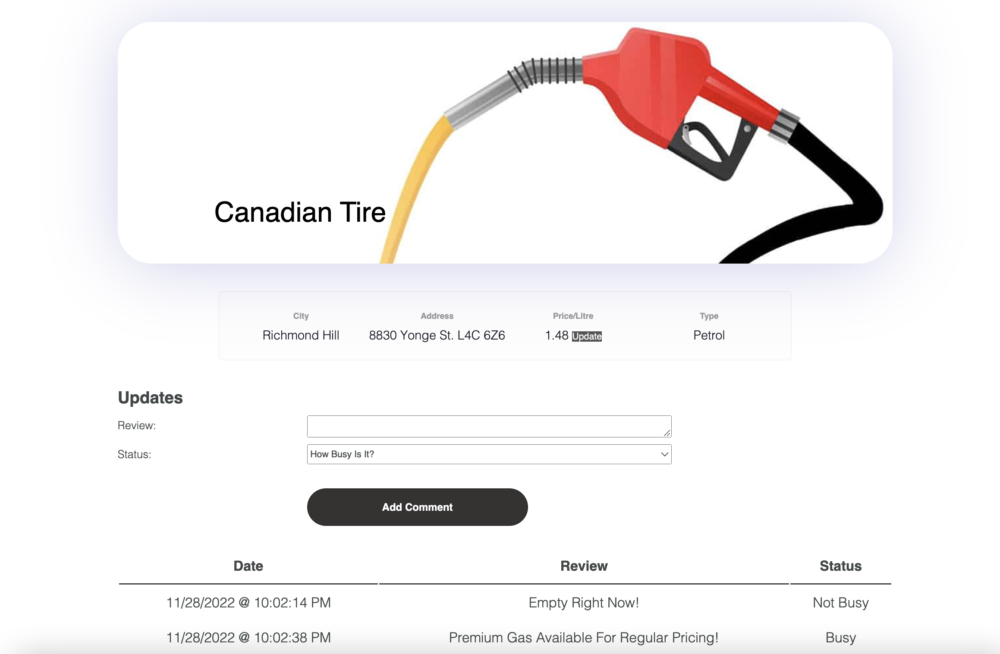
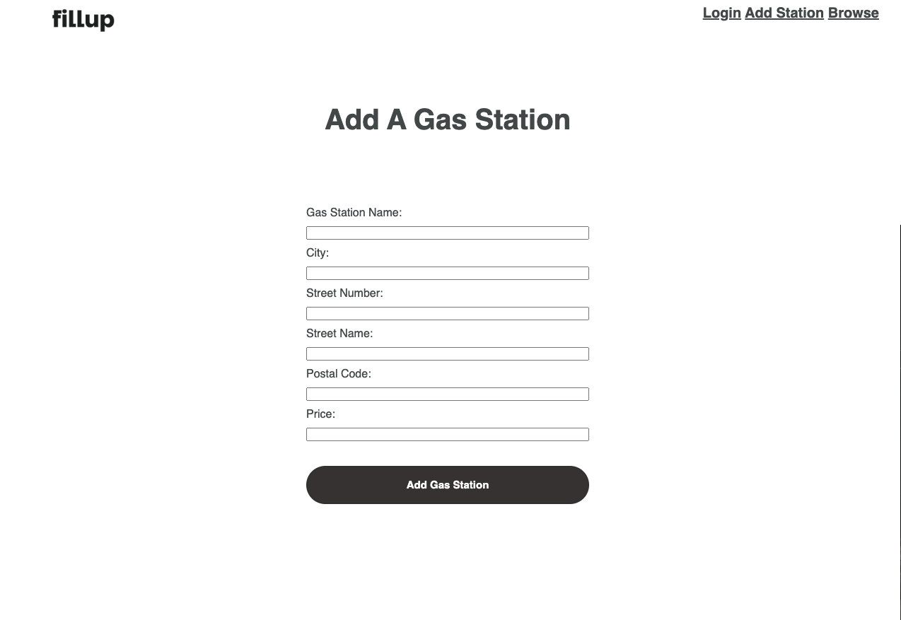

<h1>Fillup</h1>

<h3>Fillup application gives users the ability to create Gas Stations. These gas stations are added to the database once created. User's are able to view Gas Locations at their preferred city. This provides user's information to: address, price and the name of the station. A detailed page can be shown providing more details about the gas station. Users are able to update the pricing, as well as a comment page allowing users to provide an updates and whether the station is busy or not. Users logged in and non logged in users have functionality to access all the features.
</h3>

<h2>Screenshots</h2>

<h2>Technologies Used</h2>
<ul>
  <li>Express</li>
  <li>Node</li>
  <li>Mongoose</li>
  <li>MongoDb</li>
  <li>Google Oauth</li>
  <li>Passport</li>
  <li>HTML/CSS</li>
  <li>Javscript</li>
</ul>

<h2>Getting Started</h2>
<a href="https://fillup-app.herokuapp.com/">Fillup Application</a>
 
<a href="https://trello.com/invite/b/d8aQBzt4/ATTI3ba3736c0ac818904788d3499e32303b1973027A/fillup">Trello Board</a>

<h2>Next Steps</h2>
<ul>
  <li>Only allow memebrs to make changes</li>
  <li>Incorporate API to fetch Gas Prices automatically</li>
  <li>Allow users to add more cities or provinces or countries</li>

</ul>
